# :office: 쌍용 학원 관리 시스템
....
# 1. 기획 의도
관리자, 교사, 교육생 운영 시스템 
각각의 로그인으로 과정, 출결, 성적등을 관리 할 수 있는 프로그램

# 2. 🛠개발 환경
 
    

# 3. 👯‍♂️역할 분담
- 김수진 : 로그인, 관리자 기초정보 등록, 교육생 성적조회, 출결 입출력 
- 황은하 : 교사 강의계획서, 출결 조회, 배점, 성적, 출결 입출력 
- 김민정 : 관리자 개설 과정, 과목 관리 
- 김형우 : 관리자 교육생관리, 교육생 조회 수정, 교사 평가, 교육생 스터디  
- 이슬아 : 관리자 교사 관리, 조회 및 수정, 교사 평가 조회, 우수 교사 선정 
- 이혜진 : 관리자 성적, 출결 조회, 사후처리, 면접, 추천도서 

# 4. 데이터 구조
## 1. 순서도
> 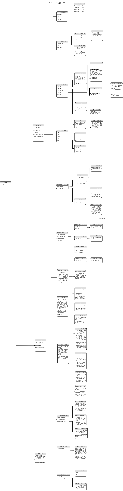

## 2. 개념 모델링
> 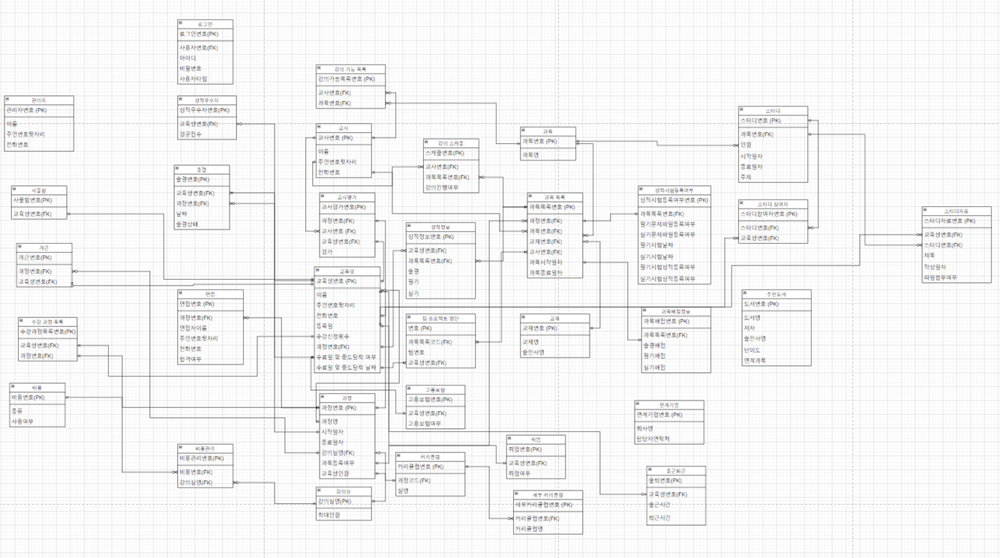

## 3. eXERD
> 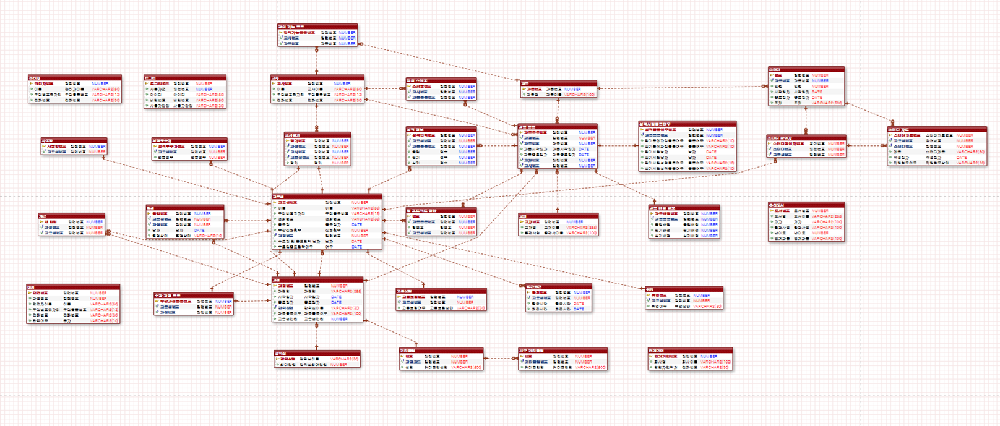

# 5. 기능 구현
## 1. 초기 화면
> - login page  
> 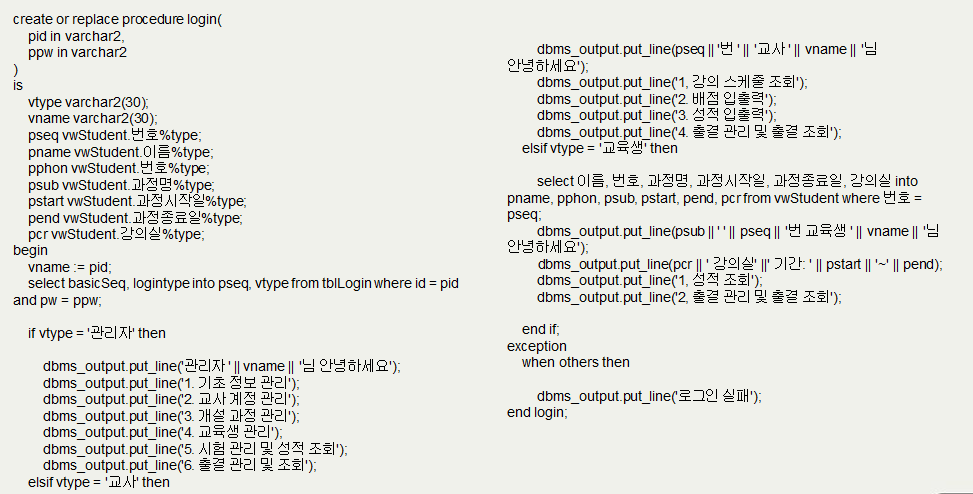
> 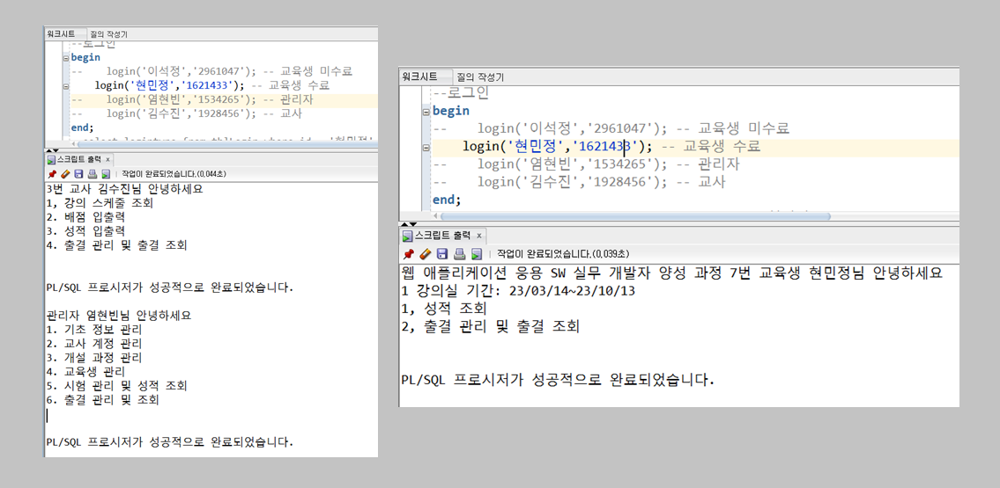

## 2. 기능 화면
> - 관리자-교사조회 
> 
> 
> - 관리자-신규 과목 등록 
> 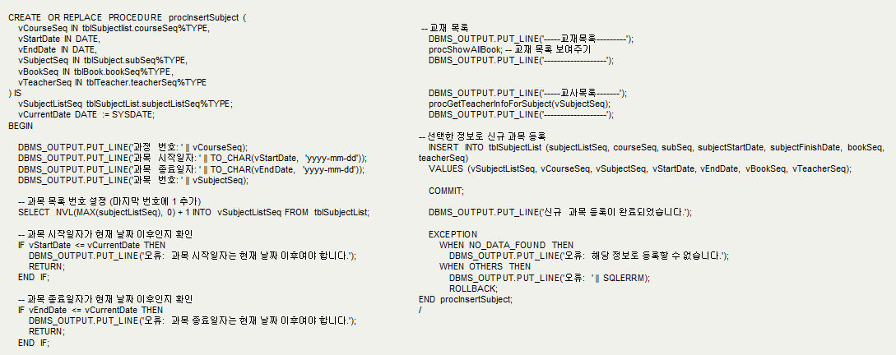
> 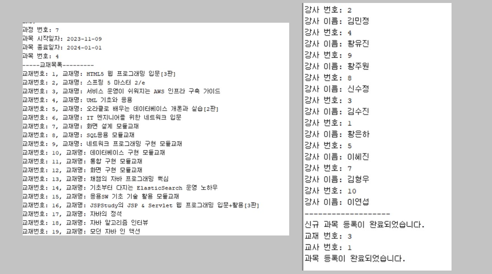
> - 관리자-면접-추가 
> 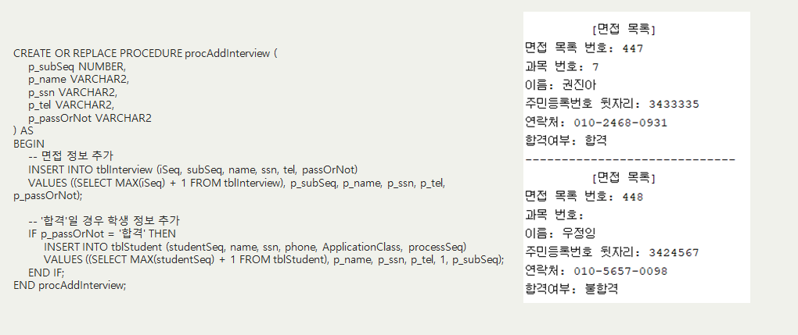
> - 관리자-면접-수정 
> 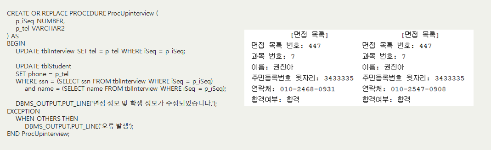
> - 관리자-면접-삭제 
> 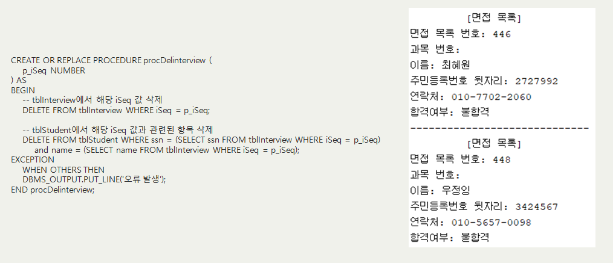
> - 교사-강의스케줄 조회  
> 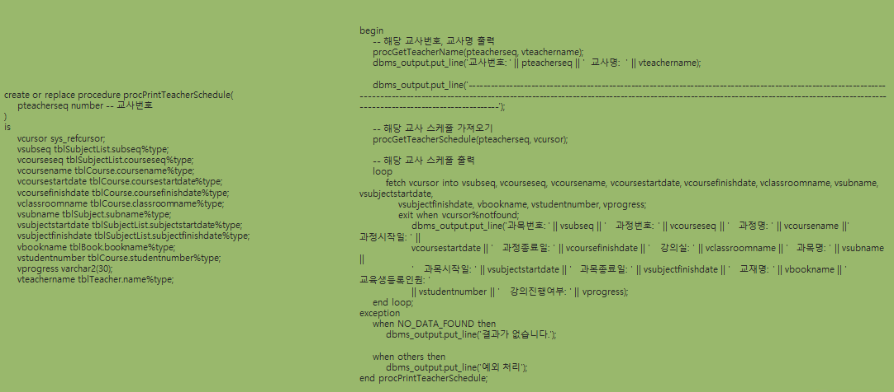
> 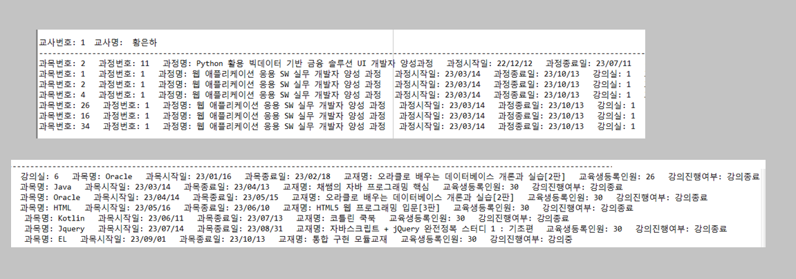
> - 교육생-성적조회  
> 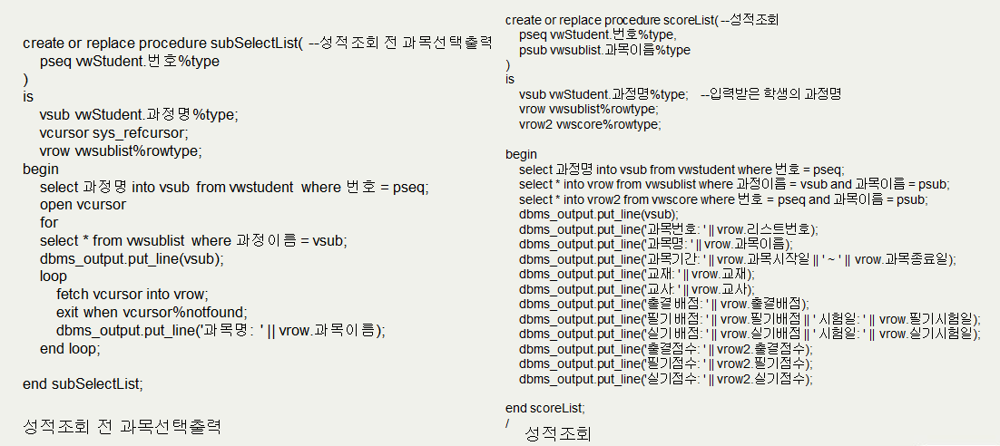
> 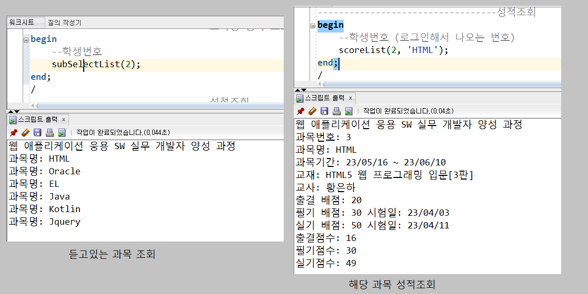

# 6. 📜세부 일정
> <strong>9월 8일 ~ 9월 12일</strong> 
>> - 요구 분석
>> - 순서도
>> - ERD 

> <strong>9월 11일 ~ 9월 14일</strong> 
>> - 테이블 정의서 작성(DDL)
>> - 더미 데이터 
>> - 데이터 정의서 작성 

> <strong>9월 14일 ~ 9월 17일</strong> 
>> - PL/SQL, ANSI/SQL 작성
>> - 데이터 통합 및 디버깅
>> - PPT 작성 

> <strong>8월 18일</strong> 
>> - 발표  
  
  # 핵심 트러블 슈팅

 <strong>1. 더미 데이터 작성과 유효성 검사가 오래 걸렸다.</strong> 

  - 출결 더미 데이터가 약 7만개 였고 그 데이터들을 insert문으로 바꾸는데 시간이 오래 걸렸다. 하지만 자바 파일 입출력으로 한번 코드를 짜 놓아 시간이 그나마 단축 되었다.  

 <strong>2. 익숙치 않은 PL/SQL에서 시간이 오래 걸렸다.</strong> 

  - PL/SQL이 자바와 비교하자면 변수,메소드,조건문등을 구현할 수 있는 코드 인데 사용법이 익숙치 않아 CRUD만 하는데도 오래 걸렸다  

# 그 외 이슈

<strong>
  </strong> 

  

  
  

  